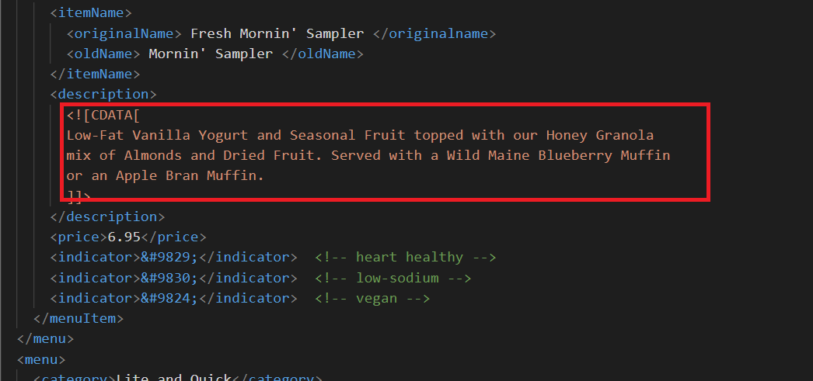
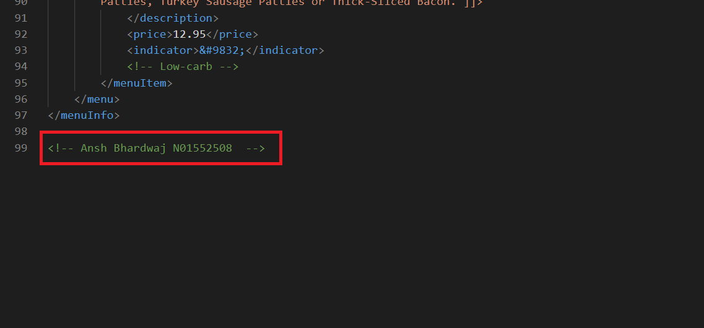
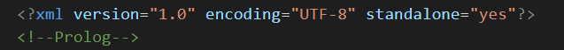
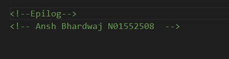
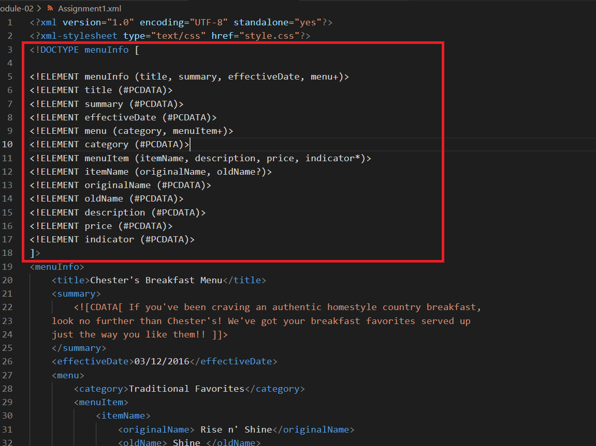
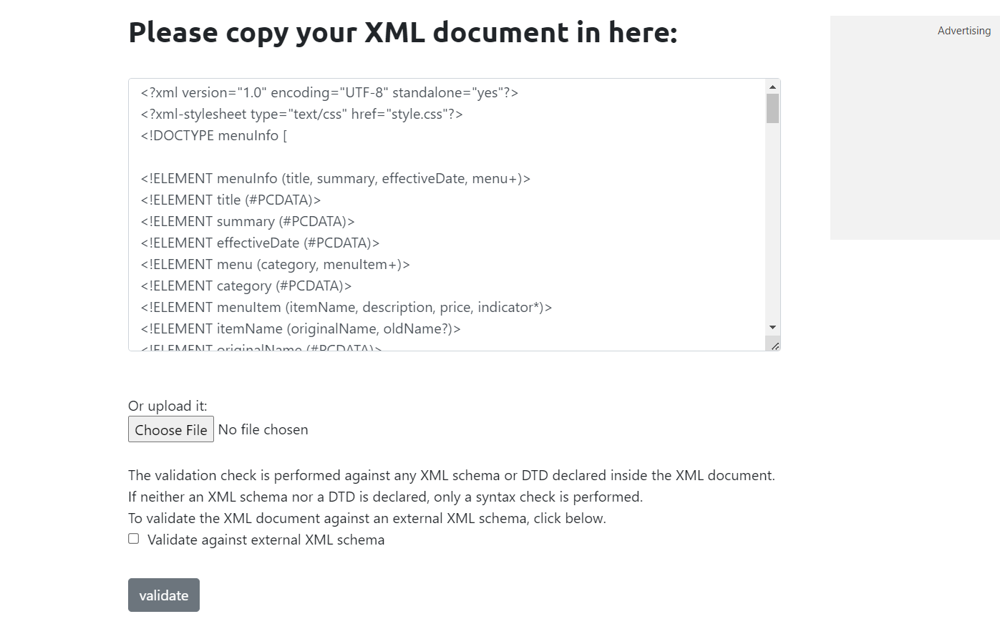
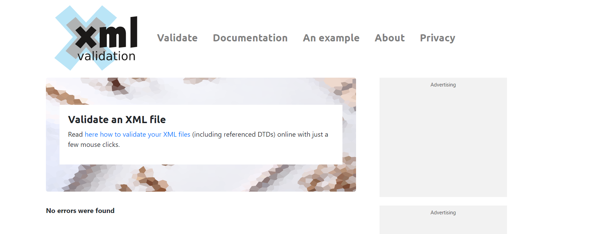
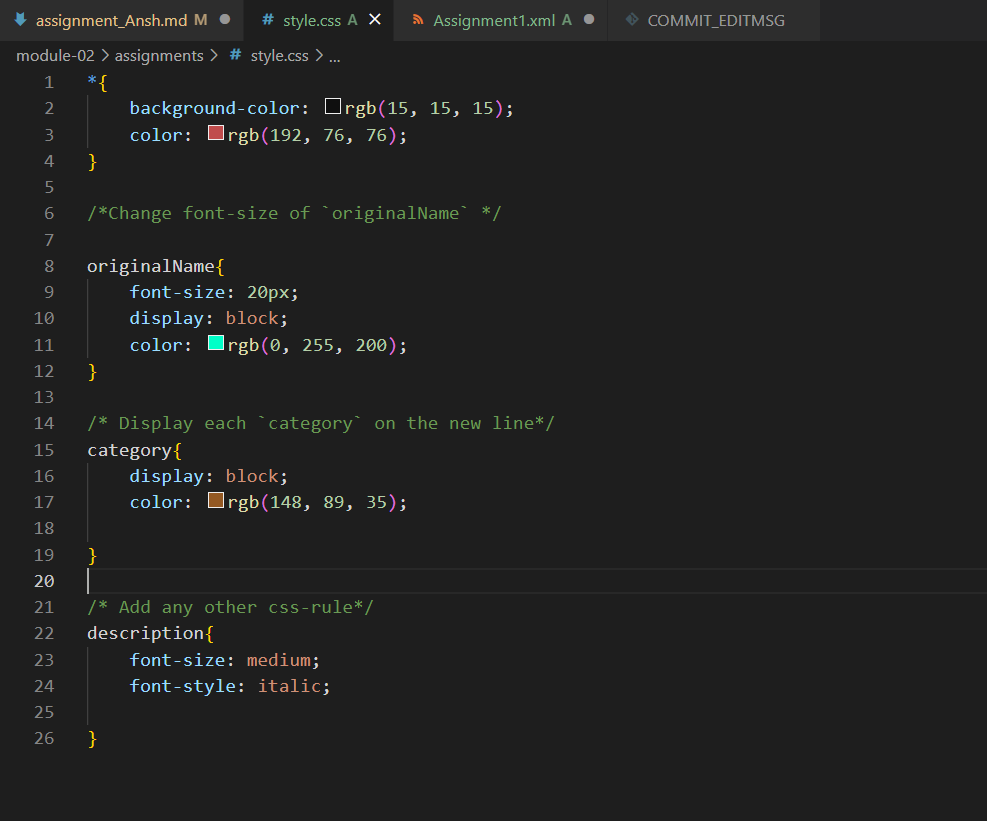

# Assignment 1 Solutions 

1. Open `module-2/assignments/assignment.xml` in your browser. Are there any errors? Explain the error and fix it.

error: <effective Date>03/12/2016</effective Date>
after fix: <effectiveDate>03/12/2016</effectiveDate>
Explaination: there is space between effective and date which its taking as attribute. by just removing space between the effective and date its consider its as date.

error: <originalName> Fresh Mornin' Sampler </originalname>
after fix: <originalName> Fresh Mornin' Sampler </originalName>
Explaination: the opening and ending tags are diiferent.

error: <name> Oatmeal Breakfast </originalName>
after fix: <originalName> Oatmeal Breakfast </originalName>
Explaination: the opening and ending tags are diiferent.

2. What is the use of CDATA block in this document?

CDATA block is used so that the XML parser interprets it only as character data, and not as markup. It comes handy when one XML data need to be embedded within another XML document.

3. Add comment line to the end of file which contains you name and student id.
<!-- Ansh Bhardwaj N01552508  -->

4. Identify prolog, document body, and epilog in the document. Are there any processing instructions?
prolog

document body

epilog

5. Add inline DTD for this document.
<!ELEMENT menuInfo (title, summary, effectiveDate, menu+)>
<!ELEMENT title (#PCDATA)>
<!ELEMENT summary (#PCDATA)>
<!ELEMENT effectiveDate (#PCDATA)>
<!ELEMENT menu (category, menuItem+)>
<!ELEMENT category (#PCDATA)>
<!ELEMENT menuItem (itemName, description, price, indicator*)>
<!ELEMENT itemName (originalName, oldName?)>
<!ELEMENT originalName (#PCDATA)>
<!ELEMENT oldName (#PCDATA)>
<!ELEMENT description (#PCDATA)>
<!ELEMENT price (#PCDATA)>
<!ELEMENT indicator (#PCDATA)>
]>

6. Verify that file is well-formed and valid.

7. Create `style.css` file and link it to the file. Add the following styles to the .css:

- Change font-size of `originalName`
- Display each `category` on the new line
- Add any other css-rule

